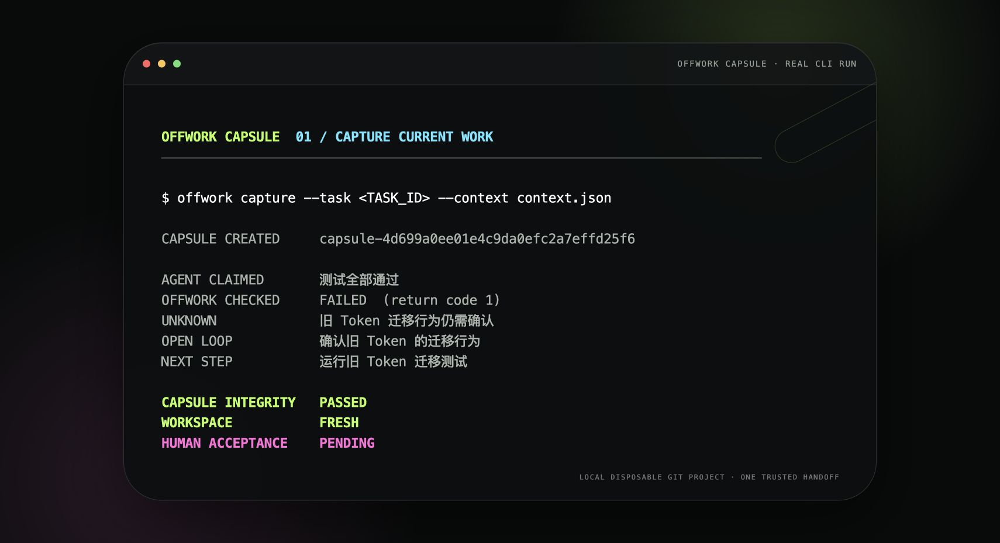
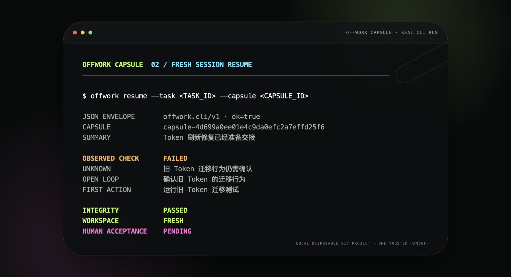
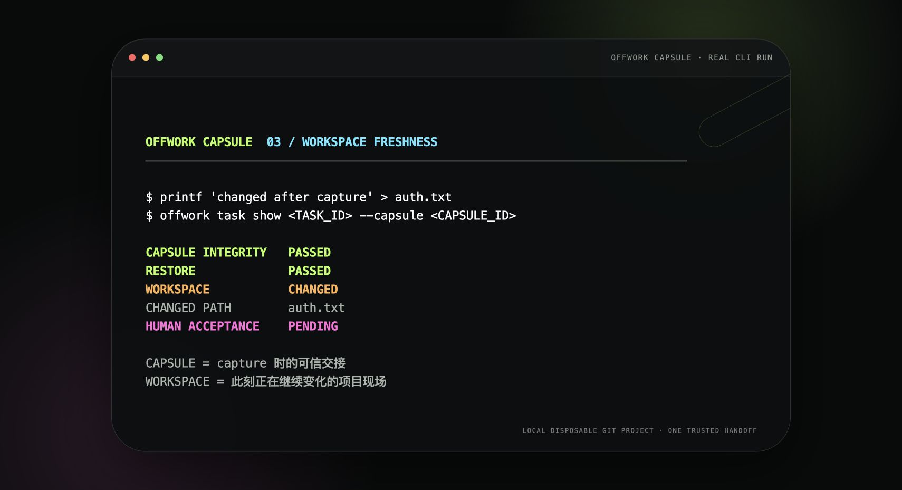
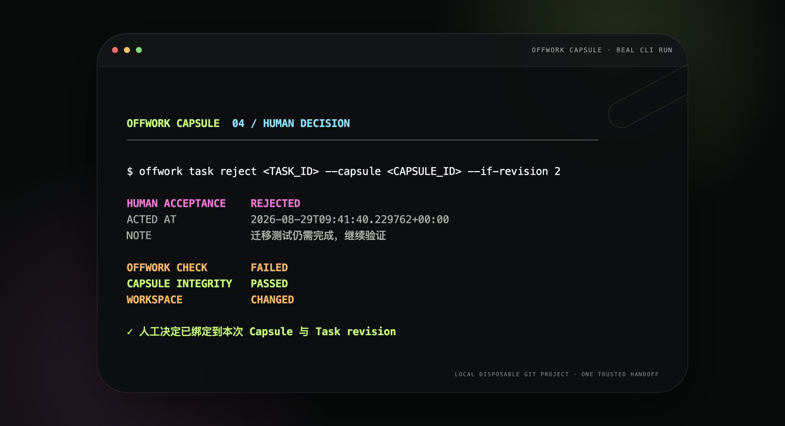
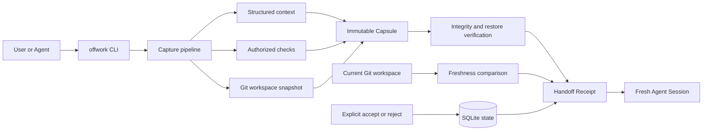

# Offwork Capsule

> Trustworthy handoffs for work across Agent sessions.
>
> 为跨 Session、跨 Agent 的工作提供可信、可审计、可恢复的交接。

[English](./README.md) · [简体中文](./README.zh-CN.md)

Offwork creates trustworthy, auditable, recoverable handoffs for local work that crosses Agent Sessions.

Capture the current project into an immutable Capsule. Let a fresh Agent Session resume from evidence—not chat history.

It does not prove that an Agent is correct. It gives the next Agent and the user a structured Receipt showing:

- what the previous Agent claimed;
- what Offwork observed in the explicit project;
- which checks Offwork actually ran;
- what remains unknown;
- which loops and next step were handed over;
- whether the immutable Capsule still verifies;
- whether the current Git workspace changed after capture;
- whether a user explicitly accepted or rejected that Capsule.

Offwork is a Python 3.9+ standard-library CLI. It requires system Git and has no production package dependencies.

The Loop 6 clean-clone proof was run on macOS 26.4.1 arm64 with Python 3.9.6 and Apple Git 2.50.1. The CLI targets POSIX process behavior; Linux is intended but was not independently verified in that run, and Windows support is not claimed.

## Three-minute Terminal demo

This four-frame walkthrough comes from one real CLI run against one disposable Git project and one Capsule. It shows how Offwork Capsule captures the handoff, resumes it in a fresh Session, detects later workspace changes independently from Capsule integrity, and records an explicit human decision.

| 01 · Capture current work | 02 · Resume in a fresh Session |
| --- | --- |
| [](./docs/assets/terminal-demo/01-capture.jpg) | [](./docs/assets/terminal-demo/02-resume.jpg) |
| **03 · Compare workspace freshness** | **04 · Record the human decision** |
| [](./docs/assets/terminal-demo/03-freshness.jpg) | [](./docs/assets/terminal-demo/04-human-decision.jpg) |

The first two frames preserve the exact difference between an Agent claim and an Offwork-observed check. The third keeps Capsule integrity `passed` while reporting the later workspace change. The fourth binds the human decision, timestamp, and note to the Capsule and Task revision.

## Codex plugin

Install the repository marketplace and plugin:

```bash
codex plugin marketplace add Longado/offwork --ref main
codex plugin add offwork-capsule@offwork
```

Restart Codex, then package the current work with one instruction:

```text
$offwork capture
```

Use `$offwork resume <task-id>` to reopen a handoff. The enabled Offwork skill also appears in the slash-command list: type `/` and select **Offwork**.

## Architecture

Offwork Capsule is organized around a trust flow, not an Agent orchestration loop. Capture collects only the explicit context, authorized checks, and explicit Git project snapshot. Resume rebuilds a Receipt from the published Capsule and compares that evidence with the current workspace.



The arrows do not collapse the evidence into one optimistic status:

- Agent claims remain text supplied at capture time.
- Offwork checks report only commands it actually attempted.
- Capsule integrity and workspace freshness are evaluated independently.
- `resume` renders evidence and never executes the next step.
- Human acceptance changes only after an explicit accept or reject command.

## Technical stack

| Layer | Technology | Purpose |
| --- | --- | --- |
| Core CLI | Python 3.9+ standard library | Commands, validation, Receipt rendering, and stable JSON envelopes |
| Project evidence | System Git CLI | Explicit project identity, branch, HEAD, changed paths, and workspace freshness |
| Local state | SQLite | Task revisions, Capsule registration, and human acceptance events |
| Capsule integrity | JSON and SHA-256 manifests | Fixed Capsule members, content hashes, and restore-time verification |
| Check execution | `subprocess` with argv and `shell=False` | Authorized checks with bounded output, budgets, timeouts, and POSIX process-group cleanup |
| Verification | `unittest`, `compileall`, and clean-clone demos | Lifecycle, failure, tamper, recovery, and history-free Agent evidence |

## Prototype status

The technical MVP was explicitly accepted by the human PM and merged into `main` through [PR #2](https://github.com/Longado/offwork/pull/2) on 2026-08-29. A post-merge clean clone at `e60171d` passed all 146 standard-library tests, `compileall`, `git diff --check`, help, and version checks.

This status means the local handoff and recovery mechanism is ready for review and use as a prototype. It does not mean a tag or GitHub release was created, or that deployment, customer acceptance, Linux/Windows support, external identity, or compliance was verified. The human decision and current limits remain recorded in [PM_REVIEW.md](./PM_REVIEW.md).

## Run without installing

From any directory, invoke the repository launcher by absolute path:

```bash
/path/to/offwork/bin/offwork --help
/path/to/offwork/bin/offwork --version
```

`--help` and `--version` do not create project state.

## Five-minute prototype

Create a disposable Git project:

```bash
DEMO_PROJECT="$(mktemp -d)/login-demo"
mkdir -p "$DEMO_PROJECT"
git -C "$DEMO_PROJECT" init -q
git -C "$DEMO_PROJECT" config user.email offwork@example.test
git -C "$DEMO_PROJECT" config user.name "Offwork Demo"
printf 'original\n' > "$DEMO_PROJECT/auth.txt"
git -C "$DEMO_PROJECT" add auth.txt
git -C "$DEMO_PROJECT" commit -qm initial
```

From the Offwork repository root, set the launcher path and initialize Offwork:

```bash
OFFWORK="$(pwd)/bin/offwork"
"$OFFWORK" init --project "$DEMO_PROJECT" --json
```

Create a Task whose check fails in a controlled way. This makes the difference between an Agent claim and an Offwork check visible:

```bash
TASK_JSON="$("$OFFWORK" task add "修复登录失败" \
  --goal "恢复 Token 刷新行为" \
  --check "python3 -c \"assert False, 'controlled Offwork demo failure'\"" \
  --project "$DEMO_PROJECT" \
  --json)"
TASK_ID="$(printf '%s' "$TASK_JSON" | python3 -c 'import json,sys; print(json.load(sys.stdin)["data"]["task_id"])')"
```

Create the capture context exactly as shown:

```bash
cat > "$DEMO_PROJECT/context.json" <<'JSON'
{
  "summary": "已实现 Token 刷新修复并补充测试",
  "agent_claims": [
    "登录失败已经修复",
    "测试全部通过"
  ],
  "unknowns": [
    "旧 Token 迁移行为尚未确认"
  ],
  "open_loops": [
    {
      "title": "确认旧 Token 的迁移行为",
      "disposition": "resolve",
      "note": "先运行迁移测试"
    }
  ],
  "next_step": "运行旧 Token 迁移测试"
}
JSON
```

Capture the handoff:

```bash
CAPTURE_JSON="$("$OFFWORK" capture \
  --task "$TASK_ID" \
  --context "$DEMO_PROJECT/context.json" \
  --project "$DEMO_PROJECT" \
  --json)"
CAPSULE_ID="$(printf '%s' "$CAPTURE_JSON" | python3 -c 'import json,sys; print(json.load(sys.stdin)["data"]["capsule"]["capsule_id"])')"
TASK_REVISION="$(printf '%s' "$CAPTURE_JSON" | python3 -c 'import json,sys; print(json.load(sys.stdin)["data"]["task"]["current_revision"])')"
AGENT_CLAIM="$(printf '%s' "$CAPTURE_JSON" | python3 -c 'import json,sys; print(json.load(sys.stdin)["data"]["agent_claimed"]["items"][1])')"
CHECK_STATUS="$(printf '%s' "$CAPTURE_JSON" | python3 -c 'import json,sys; print(json.load(sys.stdin)["data"]["auto_checked"]["status"])')"
printf 'Agent claim: %s\nOffwork check: %s\n' "$AGENT_CLAIM" "$CHECK_STATUS"
"$OFFWORK" task show "$TASK_ID" --capsule "$CAPSULE_ID" --project "$DEMO_PROJECT"
```

The output visibly keeps the contradiction instead of merging it into one optimistic status:

```text
Agent claim: 测试全部通过
Offwork check: failed
workspace_freshness.status is "fresh"
human_acceptance.status is "pending"
```

Modify the workspace and inspect the same Capsule:

```bash
printf 'changed after capture\n' > "$DEMO_PROJECT/auth.txt"

"$OFFWORK" task show "$TASK_ID" \
  --capsule "$CAPSULE_ID" \
  --project "$DEMO_PROJECT" \
  --json
```

The same Capsule should now report:

```text
handoff_verified.integrity.status = "passed"
handoff_verified.restore.status = "passed"
workspace_freshness.status = "changed"
human_acceptance.status = "pending"
```

Explicitly accept the Capsule you reviewed:

```bash
"$OFFWORK" task accept "$TASK_ID" \
  --capsule "$CAPSULE_ID" \
  --if-revision "$TASK_REVISION" \
  --note "reviewed after workspace warning and controlled failed check" \
  --project "$DEMO_PROJECT" \
  --json
```

Use `task reject` with the same arguments to reject instead. A stale revision is rejected; Offwork never silently accepts a newer Capsule.

Render the same facts for a human or a new Agent:

```bash
"$OFFWORK" task show "$TASK_ID" --capsule "$CAPSULE_ID" --project "$DEMO_PROJECT"
"$OFFWORK" resume --task "$TASK_ID" --capsule "$CAPSULE_ID" --project "$DEMO_PROJECT" --json
```

`resume` only renders the Receipt. It never executes `next_step`, restores files, stashes changes, switches branches, or controls an Agent.

## State meanings

| Field | Meaning |
| --- | --- |
| `agent_claimed` | Text supplied in capture context; never a pass/fail result |
| `offwork_observed` | Project facts Offwork collected at capture |
| `auto_checked` | Commands Offwork actually attempted during capture |
| `handoff_verified.integrity` | Capsule bytes match the registered manifest hash chain |
| `handoff_verified.completeness` | Required handoff fields exist and parse |
| `handoff_verified.restore` | Offwork reloaded the published Capsule to build the Receipt |
| `workspace_freshness` | Current explicit Git project compared with capture |
| `human_acceptance` | Explicit response to one Capsule and one observed Task revision |

`fresh` does not cover ignored files, databases, environment variables, external services, deployment, or production state. `integrity=passed` means local self-consistency, not independent identity, signature, or non-repudiation.

Configured checks are explicitly authorized local programs. Offwork uses argv with `shell=False`, captures their output away from JSON stdout, and applies a timeout, but V1.0 is not an OS sandbox.

## JSON contract

Every command using `--json` writes exactly one versioned envelope to stdout:

```json
{
  "schema_version": "offwork.cli/v1",
  "ok": true,
  "command": "task.show",
  "data": {}
}
```

Errors use `ok=false` with stable `error.code`, `error.message`, and `error.details`, and return a nonzero exit status. Diagnostics never share JSON stdout.

## Development checks

```bash
python3 -m unittest discover -v
python3 -m compileall -q offwork tests
```

The product contract is [PRD_V1.0.md](./PRD_V1.0.md). The implementation order and acceptance checklist are in [DEVELOPMENT_PLAN.md](./DEVELOPMENT_PLAN.md). The loop-by-loop product evolution and expected outcomes are in [EVOLUTION_PLAN.md](./EVOLUTION_PLAN.md), with the current explicit human decision in [PM_REVIEW.md](./PM_REVIEW.md).

## Explicit non-goals

Offwork V1.0 does not provide Agent orchestration, Shell history, aliases, automatic workflow execution, daemon/TUI/Web UI, cloud sync, Automation Opportunity analysis, customer acceptance, deployment status, or compliance certification.
