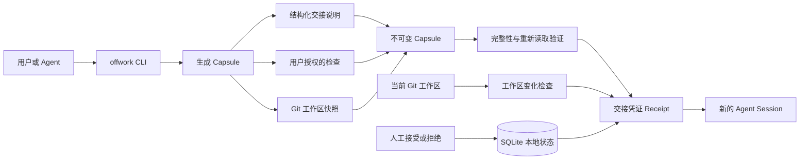

# Offwork Capsule

> 为跨 Session、跨 Agent 的工作提供可信、可审计、可恢复的交接。
>
> Trustworthy handoffs for work across Agent sessions.

[English](./README.md) · [简体中文](./README.zh-CN.md)

Offwork Capsule 是一个本地优先的 Agent 交接工具。工作被打断、跨天继续或需要切换 Session 时，它会把当下的项目现场保存成一份不可变 Capsule。下一位 Agent 不必翻看旧对话，也能依据可验证的证据继续工作。

Offwork Capsule 不替 Agent 的结论背书。它做的是生成一份结构化 Handoff Receipt，让接手者一眼看清：

- 上一位 Agent 声称了什么；
- Offwork 在指定项目中实际看到了什么；
- 哪些检查真的运行过，结果如何；
- 还有哪些问题没有答案；
- 哪些事情尚未收尾，下一步应该做什么；
- Capsule 的内容是否完整、是否被改动过；
- capture 之后，Git 工作区是否又发生了变化；
- 用户是否明确接受或拒绝了这次交接。

Offwork 使用 Python 3.9+ 标准库实现，需要系统安装 Git，核心 CLI 没有第三方运行依赖。

Loop 6 的干净克隆验证运行于 macOS 26.4.1 arm64、Python 3.9.6 和 Apple Git 2.50.1。部分进程管理依赖 POSIX 行为；Linux 尚未单独验证，当前也不声明支持 Windows。

## 3 分钟 Terminal 演示

下面四张图来自同一次真实 CLI 运行：一个临时 Git 项目、一个 Task、一个 Capsule。整段演示依次展示 Offwork Capsule 如何保存当前交接、让全新 Session 接手、识别之后发生的工作区变化，以及记录明确的人工决定。

| 01 · 保存当前工作 | 02 · 全新 Session 接手 |
| --- | --- |
| [](./docs/assets/terminal-demo/01-capture.jpg) | [](./docs/assets/terminal-demo/02-resume.jpg) |
| **03 · 识别工作区变化** | **04 · 记录人工决定** |
| [](./docs/assets/terminal-demo/03-freshness.jpg) | [](./docs/assets/terminal-demo/04-human-decision.jpg) |

前两张图会同时保留 Agent 的说法和 Offwork 实际运行检查得到的结果。第三张图显示：项目发生变化时，Capsule integrity 仍保持 `passed`，workspace freshness 会独立变为 `changed`。第四张图把人工决定、时间和备注绑定到对应的 Capsule 与 Task revision。

## Codex 插件

安装仓库 marketplace 和插件：

```bash
codex plugin marketplace add Longado/offwork --ref main
codex plugin add offwork-capsule@offwork
```

重启 Codex 后，只需输入一条指令：

```text
$offwork capture
```

使用 `$offwork resume <task-id>` 可以重新打开交接。Offwork skill 也会出现在斜杠命令列表中：输入 `/`，然后选择 **Offwork**。

## 架构

Offwork Capsule 关注的是“交接是否可信”，而不是替用户调度 Agent。执行 `capture` 时，它只收集用户提供的 context、用户授权的检查结果，以及指定 Git 项目的现场快照。执行 `resume` 时，它会从已发布的 Capsule 重新生成 Receipt，再单独比较当前工作区有没有变化。



这些信息不会被揉成一个含糊的“已验证”：

- `agent_claimed` 只是 Agent 在 capture 时留下的说法；
- `auto_checked` 只记录 Offwork 真正尝试过的检查；
- Capsule 完整性和工作区是否变化是两件独立的事；
- `resume` 只展示交接内容，不会擅自执行下一步；
- 只有用户明确执行 `accept` 或 `reject`，人工验收状态才会改变。

## 技术栈

| 层级 | 技术 | 用途 |
| --- | --- | --- |
| 核心 CLI | Python 3.9+ 标准库 | 处理命令、输入验证、Receipt 输出和稳定的 JSON envelope |
| 项目现场 | 系统 Git CLI | 识别项目、分支和 HEAD，并判断工作区是否发生变化 |
| 本地状态 | SQLite | 保存 Task revision、Capsule 登记信息和人工验收记录 |
| Capsule 完整性 | JSON 和 SHA-256 manifest | 校验固定成员、内容哈希，并验证 Capsule 能否重新读取 |
| 检查执行 | argv、`shell=False` 的 `subprocess` | 限制输出和执行时间，并在超时或异常时清理 POSIX 进程组 |
| 项目验证 | `unittest`、`compileall` 和干净克隆演示 | 覆盖正常流程、失败、篡改、恢复和无历史 Agent 接手 |

## 原型状态

技术 MVP 已由人类 PM 明确验收，并于 2026-08-29 通过 [PR #2](https://github.com/Longado/offwork/pull/2) 合并到 `main`。在提交 `e60171d` 的全新克隆中，146 项标准库测试、`compileall`、`git diff --check`、help 和 version 检查均通过。

这意味着本地交接和恢复机制已经达到可演示、可评审的技术原型水平；不代表项目已经发布，也不代表已经完成部署、客户验收、跨平台适配、身份认证或合规验证。完整的评审记录和当前限制见 [PM_REVIEW.md](./PM_REVIEW.md)。

## 无需安装即可运行

无需安装包，在任意目录直接使用仓库中启动脚本的绝对路径：

```bash
/path/to/offwork/bin/offwork --help
/path/to/offwork/bin/offwork --version
```

`--help` 和 `--version` 不会创建项目状态。

## 五分钟真实演示

创建一次性 Git 项目：

```bash
DEMO_PROJECT="$(mktemp -d)/login-demo"
mkdir -p "$DEMO_PROJECT"
git -C "$DEMO_PROJECT" init -q
git -C "$DEMO_PROJECT" config user.email offwork@example.test
git -C "$DEMO_PROJECT" config user.name "Offwork Demo"
printf 'original\n' > "$DEMO_PROJECT/auth.txt"
git -C "$DEMO_PROJECT" add auth.txt
git -C "$DEMO_PROJECT" commit -qm initial
```

在 Offwork 仓库根目录设置 launcher 并初始化项目：

```bash
OFFWORK="$(pwd)/bin/offwork"
"$OFFWORK" init --project "$DEMO_PROJECT" --json
```

给 Task 配一个预期会失败的检查，这样可以直观看到“Agent 说测试通过”和“Offwork 实际检查失败”并不是同一件事：

```bash
TASK_JSON="$("$OFFWORK" task add "修复登录失败" \
  --goal "恢复 Token 刷新行为" \
  --check "python3 -c \"assert False, 'controlled Offwork demo failure'\"" \
  --project "$DEMO_PROJECT" \
  --json)"
TASK_ID="$(printf '%s' "$TASK_JSON" | python3 -c 'import json,sys; print(json.load(sys.stdin)["data"]["task_id"])')"
```

准备本次交接的结构化 context：

```bash
cat > "$DEMO_PROJECT/context.json" <<'JSON'
{
  "summary": "已实现 Token 刷新修复并补充测试",
  "agent_claims": [
    "登录失败已经修复",
    "测试全部通过"
  ],
  "unknowns": [
    "旧 Token 迁移行为尚未确认"
  ],
  "open_loops": [
    {
      "title": "确认旧 Token 的迁移行为",
      "disposition": "resolve",
      "note": "先运行迁移测试"
    }
  ],
  "next_step": "运行旧 Token 迁移测试"
}
JSON
```

生成 Capsule：

```bash
CAPTURE_JSON="$("$OFFWORK" capture \
  --task "$TASK_ID" \
  --context "$DEMO_PROJECT/context.json" \
  --project "$DEMO_PROJECT" \
  --json)"
CAPSULE_ID="$(printf '%s' "$CAPTURE_JSON" | python3 -c 'import json,sys; print(json.load(sys.stdin)["data"]["capsule"]["capsule_id"])')"
TASK_REVISION="$(printf '%s' "$CAPTURE_JSON" | python3 -c 'import json,sys; print(json.load(sys.stdin)["data"]["task"]["current_revision"])')"
AGENT_CLAIM="$(printf '%s' "$CAPTURE_JSON" | python3 -c 'import json,sys; print(json.load(sys.stdin)["data"]["agent_claimed"]["items"][1])')"
CHECK_STATUS="$(printf '%s' "$CAPTURE_JSON" | python3 -c 'import json,sys; print(json.load(sys.stdin)["data"]["auto_checked"]["status"])')"
printf 'Agent claim: %s\nOffwork check: %s\n' "$AGENT_CLAIM" "$CHECK_STATUS"
"$OFFWORK" task show "$TASK_ID" --capsule "$CAPSULE_ID" --project "$DEMO_PROJECT"
```

Agent 的说法和 Offwork 的检查结果会同时保留，不会被合并成一个乐观结论：

```text
Agent claim: 测试全部通过
Offwork check: failed
workspace_freshness.status is "fresh"
human_acceptance.status is "pending"
```

接着修改工作区，再查看同一个 Capsule：

```bash
printf 'changed after capture\n' > "$DEMO_PROJECT/auth.txt"

"$OFFWORK" task show "$TASK_ID" \
  --capsule "$CAPSULE_ID" \
  --project "$DEMO_PROJECT" \
  --json
```

同一个 Capsule 此时应显示：

```text
handoff_verified.integrity.status = "passed"
handoff_verified.restore.status = "passed"
workspace_freshness.status = "changed"
human_acceptance.status = "pending"
```

确认看过 Receipt 后，明确接受这次交接：

```bash
"$OFFWORK" task accept "$TASK_ID" \
  --capsule "$CAPSULE_ID" \
  --if-revision "$TASK_REVISION" \
  --note "reviewed after workspace warning and controlled failed check" \
  --project "$DEMO_PROJECT" \
  --json
```

也可以使用同样的参数执行 `task reject`。如果 revision 已经过期，Offwork 会要求重新查看 Receipt，不会悄悄把决定套用到更新后的 Capsule。

需要把交接内容交给人或新的 Agent 时，使用下面两个命令读取同一组事实：

```bash
"$OFFWORK" task show "$TASK_ID" --capsule "$CAPSULE_ID" --project "$DEMO_PROJECT"
"$OFFWORK" resume --task "$TASK_ID" --capsule "$CAPSULE_ID" --project "$DEMO_PROJECT" --json
```

`resume` 只负责展示 Receipt。它不会执行 `next_step`，也不会恢复文件、stash 修改、切换分支或控制 Agent。

## 状态含义

| 字段 | 含义 |
| --- | --- |
| `agent_claimed` | capture context 中由 Agent 提供的说法，不代表检查结果 |
| `offwork_observed` | Offwork 在指定项目中实际采集到的现场 |
| `auto_checked` | Offwork 真正尝试运行过的检查及其结果 |
| `handoff_verified.integrity` | Capsule 固定成员与登记过的 manifest 哈希一致 |
| `handoff_verified.completeness` | 必需交接字段存在且可解析 |
| `handoff_verified.restore` | Offwork 能从已发布的 Capsule 重新读取并构建 Receipt |
| `workspace_freshness` | 当前 Git 项目与 capture 时相比是否发生变化 |
| `human_acceptance` | 用户针对指定 Capsule 和 Task revision 做出的明确决定 |

`fresh` 只说明本项目定义的 Git 工作区没有变化，不覆盖 ignored files、数据库、环境变量、外部服务、部署或生产状态。`integrity=passed` 只表示 Capsule 在本地自洽，不代表它具备独立身份、数字签名或不可抵赖能力。

检查命令由用户明确配置。Offwork 使用 argv 和 `shell=False` 执行，并限制输出和运行时间，但 V1.0 不是操作系统级沙箱。

## JSON 合同

使用 `--json` 时，每条命令只会向 stdout 写入一个带版本的 envelope：

```json
{
  "schema_version": "offwork.cli/v1",
  "ok": true,
  "command": "task.show",
  "data": {}
}
```

发生错误时，命令返回非零状态码，并在 envelope 中提供稳定的 `error.code`、`error.message` 和 `error.details`。诊断信息不会混入 JSON stdout。

## 开发验证

```bash
python3 -m unittest discover -v
python3 -m compileall -q offwork tests
```

产品合同见 [PRD_V1.0.md](./PRD_V1.0.md)，实现顺序和验收清单见 [DEVELOPMENT_PLAN.md](./DEVELOPMENT_PLAN.md)，演进计划见 [EVOLUTION_PLAN.md](./EVOLUTION_PLAN.md)，当前人类决定见 [PM_REVIEW.md](./PM_REVIEW.md)。

## 明确不做

Offwork V1.0 不负责调度 Agent，也不提供 Shell history、alias、自动工作流、daemon、TUI、正式 Web UI、云同步或 Automation Opportunity 分析。它同样不能代表客户验收、部署状态或合规认证。
