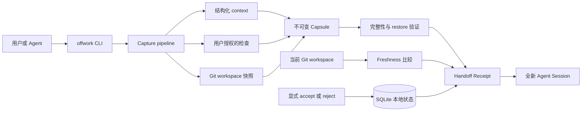

# Offwork Capsule

> 为跨 Session、跨 Agent 的工作提供可信、可审计、可恢复的交接。
>
> Trustworthy handoffs for work across Agent sessions.

[English](./README.md) · [简体中文](./README.zh-CN.md)

Offwork Capsule 面向跨 Agent Session 的本地工作交接。它把当前项目打包成不可变 Capsule，让没有旧聊天历史的新 Agent Session 从证据恢复，而不是从记忆猜测。

它不证明 Agent 的结论正确，而是向下一位 Agent 和用户提供结构化 Handoff Receipt，明确显示：

- 上一位 Agent 声称了什么；
- Offwork 在显式项目边界内观察到了什么；
- Offwork 真正运行了哪些检查；
- 哪些事项仍然未知；
- 哪些 open loops 和 next step 被交接；
- 不可变 Capsule 当前是否仍能通过验证；
- Git workspace 在 capture 后是否发生变化；
- 用户是否显式接受或拒绝了这次交接。

Offwork 是 Python 3.9+ 标准库实现的 CLI，需要系统 Git，没有生产环境第三方包依赖。

Loop 6 clean-clone 验证运行于 macOS 26.4.1 arm64、Python 3.9.6 和 Apple Git 2.50.1。CLI 依赖 POSIX 进程行为；Linux 计划支持但尚未在该轮独立验证，不声明支持 Windows。

## 架构

Offwork Capsule 围绕可信交接链路设计，而不是 Agent 自动编排。Capture 只采集显式 context、用户授权的检查和明确 Git 项目边界内的 workspace 快照。Resume 从已经发布的 Capsule 重新构建 Receipt，并将历史证据与当前 workspace 分开比较。



图中的事实不会合并成一个乐观的总状态：

- Agent claim 始终是 capture 时提供的文本声明；
- Offwork check 只报告系统真正尝试运行的命令；
- Capsule integrity 与 workspace freshness 独立判断；
- `resume` 只渲染证据，不会执行 next step；
- human acceptance 只能由显式 accept 或 reject 命令改变。

## 技术栈

| 层级 | 技术 | 用途 |
| --- | --- | --- |
| 核心 CLI | Python 3.9+ 标准库 | 命令、验证、Receipt 渲染和稳定 JSON envelope |
| 项目证据 | 系统 Git CLI | 显式项目身份、branch、HEAD、changed paths 和 workspace freshness |
| 本地状态 | SQLite | Task revision、Capsule 注册和人工验收事件 |
| Capsule 完整性 | JSON 和 SHA-256 manifest | 固定成员、内容哈希和 restore 时验证 |
| 检查执行 | argv、`shell=False` 的 `subprocess` | 有界输出、预算、超时和 POSIX 进程组清理 |
| 验证 | `unittest`、`compileall` 和 clean-clone 演示 | 生命周期、失败、篡改、恢复和无历史 Agent 证据 |

## 原型状态

技术 MVP 已由人类 PM 显式接受，并于 2026-08-29 通过 [PR #2](https://github.com/Longado/offwork/pull/2) 合并到 `main`。合并后的 clean clone 在 `e60171d` 通过全部 146 项标准库测试、`compileall`、`git diff --check`、help 和 version 检查。

这个状态表示本地交接和恢复机制已经可以作为技术原型评审和使用。它不表示已经创建 tag 或 GitHub release，也不表示完成部署、客户验收、Linux/Windows 支持、外部身份或合规验证。当前人类决定和限制记录在 [PM_REVIEW.md](./PM_REVIEW.md)。

## 无需安装即可运行

在任意目录使用仓库 launcher 的绝对路径：

```bash
/path/to/offwork/bin/offwork --help
/path/to/offwork/bin/offwork --version
```

`--help` 和 `--version` 不会创建项目状态。

## 五分钟真实演示

创建一次性 Git 项目：

```bash
DEMO_PROJECT="$(mktemp -d)/login-demo"
mkdir -p "$DEMO_PROJECT"
git -C "$DEMO_PROJECT" init -q
git -C "$DEMO_PROJECT" config user.email offwork@example.test
git -C "$DEMO_PROJECT" config user.name "Offwork Demo"
printf 'original\n' > "$DEMO_PROJECT/auth.txt"
git -C "$DEMO_PROJECT" add auth.txt
git -C "$DEMO_PROJECT" commit -qm initial
```

在 Offwork 仓库根目录设置 launcher 并初始化项目：

```bash
OFFWORK="$(pwd)/bin/offwork"
"$OFFWORK" init --project "$DEMO_PROJECT" --json
```

创建一个会受控失败的检查，用来展示 Agent claim 和 Offwork check 的区别：

```bash
TASK_JSON="$("$OFFWORK" task add "修复登录失败" \
  --goal "恢复 Token 刷新行为" \
  --check "python3 -c \"assert False, 'controlled Offwork demo failure'\"" \
  --project "$DEMO_PROJECT" \
  --json)"
TASK_ID="$(printf '%s' "$TASK_JSON" | python3 -c 'import json,sys; print(json.load(sys.stdin)["data"]["task_id"])')"
```

创建结构化 capture context：

```bash
cat > "$DEMO_PROJECT/context.json" <<'JSON'
{
  "summary": "已实现 Token 刷新修复并补充测试",
  "agent_claims": [
    "登录失败已经修复",
    "测试全部通过"
  ],
  "unknowns": [
    "旧 Token 迁移行为尚未确认"
  ],
  "open_loops": [
    {
      "title": "确认旧 Token 的迁移行为",
      "disposition": "resolve",
      "note": "先运行迁移测试"
    }
  ],
  "next_step": "运行旧 Token 迁移测试"
}
JSON
```

Capture 交接：

```bash
CAPTURE_JSON="$("$OFFWORK" capture \
  --task "$TASK_ID" \
  --context "$DEMO_PROJECT/context.json" \
  --project "$DEMO_PROJECT" \
  --json)"
CAPSULE_ID="$(printf '%s' "$CAPTURE_JSON" | python3 -c 'import json,sys; print(json.load(sys.stdin)["data"]["capsule"]["capsule_id"])')"
TASK_REVISION="$(printf '%s' "$CAPTURE_JSON" | python3 -c 'import json,sys; print(json.load(sys.stdin)["data"]["task"]["current_revision"])')"
AGENT_CLAIM="$(printf '%s' "$CAPTURE_JSON" | python3 -c 'import json,sys; print(json.load(sys.stdin)["data"]["agent_claimed"]["items"][1])')"
CHECK_STATUS="$(printf '%s' "$CAPTURE_JSON" | python3 -c 'import json,sys; print(json.load(sys.stdin)["data"]["auto_checked"]["status"])')"
printf 'Agent claim: %s\nOffwork check: %s\n' "$AGENT_CLAIM" "$CHECK_STATUS"
"$OFFWORK" task show "$TASK_ID" --capsule "$CAPSULE_ID" --project "$DEMO_PROJECT"
```

输出会保留矛盾事实，而不是合并成乐观结论：

```text
Agent claim: 测试全部通过
Offwork check: failed
workspace_freshness.status is "fresh"
human_acceptance.status is "pending"
```

修改 workspace 后查看同一个 Capsule：

```bash
printf 'changed after capture\n' > "$DEMO_PROJECT/auth.txt"

"$OFFWORK" task show "$TASK_ID" \
  --capsule "$CAPSULE_ID" \
  --project "$DEMO_PROJECT" \
  --json
```

同一个 Capsule 此时应显示：

```text
handoff_verified.integrity.status = "passed"
handoff_verified.restore.status = "passed"
workspace_freshness.status = "changed"
human_acceptance.status = "pending"
```

显式接受已经查看的 Capsule：

```bash
"$OFFWORK" task accept "$TASK_ID" \
  --capsule "$CAPSULE_ID" \
  --if-revision "$TASK_REVISION" \
  --note "reviewed after workspace warning and controlled failed check" \
  --project "$DEMO_PROJECT" \
  --json
```

也可以使用同样参数执行 `task reject`。若 revision 已过期，Offwork 会拒绝写入；它不会静默改为接受更新后的 Capsule。

为人类或新 Agent 渲染同一组事实：

```bash
"$OFFWORK" task show "$TASK_ID" --capsule "$CAPSULE_ID" --project "$DEMO_PROJECT"
"$OFFWORK" resume --task "$TASK_ID" --capsule "$CAPSULE_ID" --project "$DEMO_PROJECT" --json
```

`resume` 只渲染 Receipt。它不会执行 `next_step`、恢复文件、stash 修改、切换分支或控制 Agent。

## 状态含义

| 字段 | 含义 |
| --- | --- |
| `agent_claimed` | capture context 中提供的文本，永远不是 pass/fail 结果 |
| `offwork_observed` | Offwork 在显式项目边界内采集的事实 |
| `auto_checked` | Offwork 真正尝试执行的命令 |
| `handoff_verified.integrity` | Capsule 固定成员与已注册 manifest hash chain 一致 |
| `handoff_verified.completeness` | 必需交接字段存在且可解析 |
| `handoff_verified.restore` | Offwork 从已发布 Capsule 重新加载并构建 Receipt 成功 |
| `workspace_freshness` | 当前显式 Git 项目相对 capture 时是否变化 |
| `human_acceptance` | 用户针对一个明确 Capsule 和一个已观察 Task revision 的显式决定 |

`fresh` 不覆盖 ignored files、数据库、环境变量、外部服务、部署或生产状态。`integrity=passed` 表示本地自洽，不表示独立身份、签名或不可抵赖。

配置的检查是用户显式授权的本地程序。Offwork 使用 argv 和 `shell=False`，将命令输出与 JSON stdout 隔离并应用超时，但 V1.0 不是 OS sandbox。

## JSON 合同

每个使用 `--json` 的命令只向 stdout 写入一个带版本的 envelope：

```json
{
  "schema_version": "offwork.cli/v1",
  "ok": true,
  "command": "task.show",
  "data": {}
}
```

错误返回 `ok=false`、稳定的 `error.code`、`error.message` 和 `error.details`，同时返回非零状态码。诊断信息不会混入 JSON stdout。

## 开发验证

```bash
python3 -m unittest discover -v
python3 -m compileall -q offwork tests
```

产品合同见 [PRD_V1.0.md](./PRD_V1.0.md)，实现顺序和验收清单见 [DEVELOPMENT_PLAN.md](./DEVELOPMENT_PLAN.md)，演进计划见 [EVOLUTION_PLAN.md](./EVOLUTION_PLAN.md)，当前人类决定见 [PM_REVIEW.md](./PM_REVIEW.md)。

## 明确不做

Offwork V1.0 不提供 Agent 编排、Shell history、alias、自动工作流、daemon、TUI、正式 Web UI、云同步、Automation Opportunity 分析、客户验收、部署状态或合规认证。
